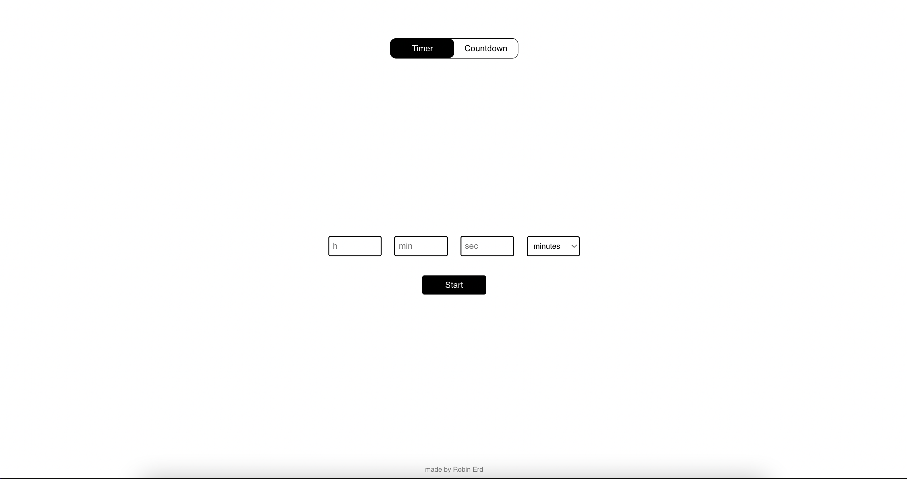
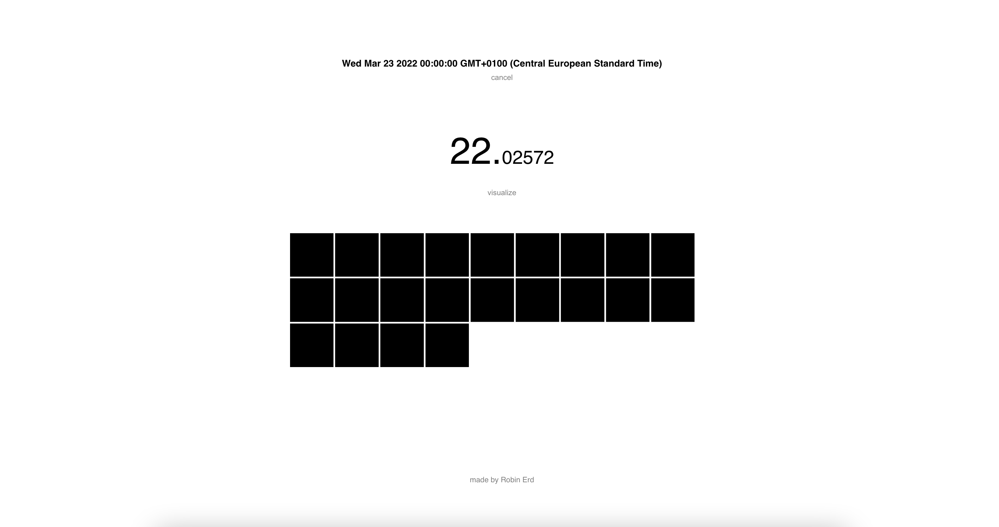
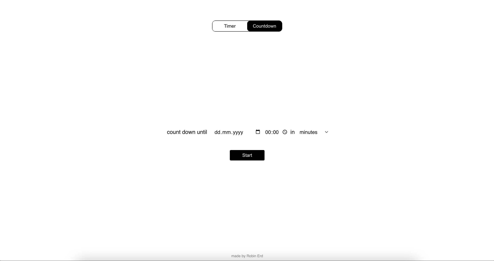
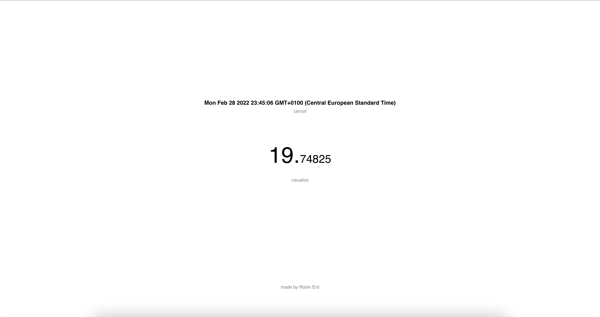

# countdown
a minimal tool for calculating time-difference between now and then, with optional visualization

Key features:
- timer
- countdown
- nice disappearing blocks that represent days, minutes or seconds
- uses cookies to save your timer or countdown
- does not contain any ads or tracking
- works on mobile

I wrote this because I want to have an equivalent to crossing boxes on the calender for adults. <br>
And I wanted it without ads. I added the visualization because I wanted to learn about the use of canvas anyways.

<p float="left">
  
   
</p>

<p float="left">
  
   
</p>

### Compiles and hot-reloads for development

- use `nvm` to install node 16 with `nvm install 16`
- `nvm use 16`
- `npm install`
- `npm run serve`

### Compiles and minifies for production
```
npm run build --production
```

